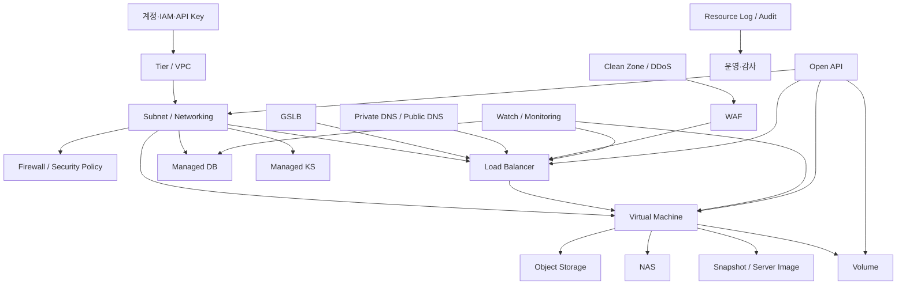
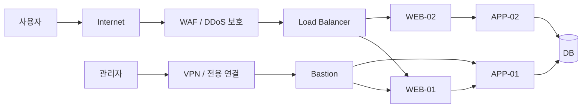
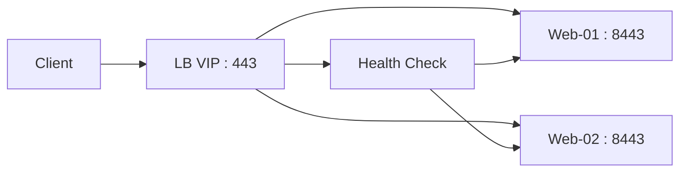
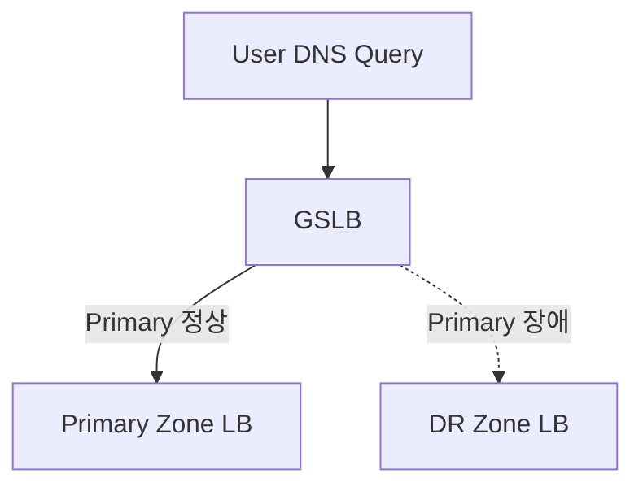
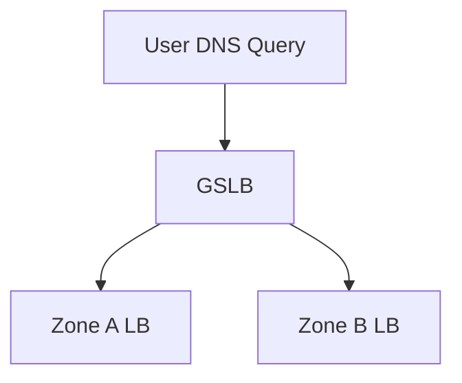
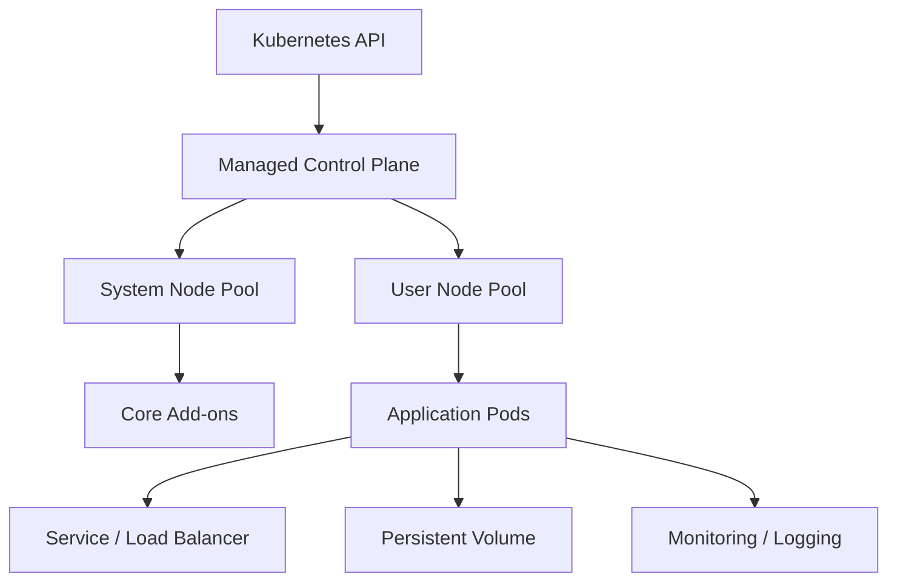
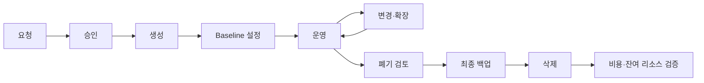

# KT Cloud Platform @G 주요 리소스 사용 및 운영 관리

> **교육용 상세 강의 문서**  
> 작성 기준일: **2026-07-15**  
> 대상 플랫폼: **KT Cloud Platform @G / G-Cloud**  
> 권장 대상: 클라우드 입문자, 시스템·네트워크 운영자, MSP 운영자, 클라우드 아키텍트  
> 권장 교육 시간: **18시간(이론 11시간 + 실습 7시간)**

---

## 문서 사용 전 중요 안내

KT Cloud Platform @G는 서비스 가입 시점, 존(Zone), 네트워크 유형, 계약 상품에 따라 콘솔 메뉴와 지원 기능이 다를 수 있다. 특히 G1/G2, D1, 신규 KCP 계열은 리소스 명칭과 네트워크 모델이 일부 다르다.

따라서 이 문서는 다음 원칙으로 작성했다.

1. **Platform @G의 공통 리소스 모델**을 중심으로 설명한다.
2. 메뉴 명칭은 대표적인 콘솔 기준으로 작성하되, 실제 콘솔의 명칭을 우선한다.
3. 상품별 제한값, 지원 OS, 지원 포트, 최대 용량, 요금은 변경될 수 있으므로 생성 직전 최신 콘솔과 공식 매뉴얼에서 다시 확인한다.
4. 문서에서 **“KT Cloud 기능”**은 공식 서비스 기능을 의미하고, **“운영 권장”**은 일반적인 클라우드 운영 모범 사례를 의미한다.
5. 운영 환경에서는 콘솔 작업 전에 변경 요청, 영향도 분석, 백업·복구 계획, 롤백 계획을 반드시 준비한다.

---

# 1. 교육 개요

## 1.1 교육 목표

교육을 마치면 수강생은 다음 작업을 수행할 수 있어야 한다.

- KT Cloud의 계정, 도메인, 프로젝트 또는 권한 구조를 이해한다.
- 가상 서버를 생성하고 안전하게 접속하며 운영 상태를 점검한다.
- Tier/VPC, 네트워크, 방화벽, 포트 포워딩, 공인 IP를 설계한다.
- Volume, Snapshot, Server Image, NAS, Object Storage를 목적에 맞게 선택한다.
- Load Balancer와 GSLB를 사용하여 고가용성 구조를 구성한다.
- 관리형 데이터베이스와 Managed KS의 기본 구조 및 운영 포인트를 이해한다.
- WAF, Clean Zone, 인증서, 접근 통제 기능을 사용하여 보안 수준을 높인다.
- Watch, Resource Log, 알람 기능을 이용해 장애를 조기에 탐지한다.
- Open API의 Key/Secret을 안전하게 관리하고 자동화에 활용한다.
- 비용, 성능, 가용성, 보안 관점의 일상 운영 체크리스트를 적용한다.

## 1.2 권장 선수 지식

| 영역 | 필요한 기초 지식 |
|---|---|
| Linux | SSH, 계정·권한, 디스크·파일시스템, systemd, 로그 확인 |
| Windows | RDP, 디스크 관리, 이벤트 뷰어, 서비스 관리 |
| Network | IP/CIDR, Subnet, Routing, NAT, Firewall, DNS, L4/L7 |
| Storage | Block/File/Object Storage 차이, Snapshot과 Backup 차이 |
| Database | DB 접속, 계정, 포트, 백업·복구 기본 개념 |
| Kubernetes | Pod, Deployment, Service, Ingress, Node 기본 개념 |
| Security | 최소 권한, MFA, Key 관리, 패치, 로그 감사 |

## 1.3 권장 강의 구성

| 일차 | 모듈 | 이론 | 실습 |
|---|---|---:|---:|
| 1일차 | 플랫폼 구조, 계정·권한, Server, Volume·Image | 4시간 | 2시간 |
| 2일차 | Network, Load Balancer, GSLB, NAS·Object Storage | 4시간 | 3시간 |
| 3일차 | DB, Managed KS, Security, Monitoring, API, 운영 표준 | 3시간 | 2시간 |

---

# 2. KT Cloud Platform @G 리소스 전체 구조

KT Cloud Platform @G Open API는 Computing, Network, Storage, CDN, Security, Management 영역으로 구성된다. 대표 리소스에는 Virtual Machine, Networking, Tier, Volume, Image/Snapshot, SSH Keypair, Resource Log, Load Balancer, GSLB, NAS, Object Storage, WAF, Auto Scaling, Watch, Messaging 등이 있다.



## 2.1 리소스 선택 요약

| 요구사항 | 우선 검토 리소스 | 핵심 관리 포인트 |
|---|---|---|
| 애플리케이션 실행 | Server/VM | 사양, OS 패치, 접속 통제, 모니터링 |
| 추가 디스크 | Volume | 파일시스템, 마운트, 스냅샷, 용량 임계치 |
| 서버 복제·표준 배포 | Server Image | 이미지 최신화, 민감정보 제거 |
| 빠른 복원 지점 | Snapshot | 정합성, 보관 기간, 복원 테스트 |
| 여러 서버의 파일 공유 | NAS | NFS/CIFS, ACL, 성능, 마운트 안정성 |
| 대용량 비정형 데이터 | Object Storage | 버킷 권한, 수명주기, 암호화, API Key |
| 트래픽 분산 | Load Balancer | Health Check, 세션, 타임아웃, Backend 용량 |
| 존·사이트 단위 분산 | GSLB | DNS TTL, Health Check, DR 전환 절차 |
| 데이터베이스 | DBaaS | HA, 백업, Parameter, 접근제어, 모니터링 |
| Kubernetes | Managed KS | 버전, 노드, CNI, 스토리지, 업그레이드 |
| 웹 공격 차단 | WAF | 정책 튜닝, 오탐, 인증서, 로그 분석 |
| DDoS 대응 | Clean Zone | 보호 대상, 우회·차단 정책, 연락 체계 |
| 상태 감시 | Watch | 지표, 임계치, 알람 채널, Runbook |
| 자동화 | Open API | Key/Secret, 서명, 비동기 작업, 재시도 |

---

# 3. 계정, 도메인, 권한 및 API 자격 증명

## 3.1 계정 구조 이해

G-Cloud는 고객사 단위의 도메인 또는 계약 단위를 기반으로 계정과 리소스를 관리할 수 있다. 실제 계정 구조는 계약 형태와 콘솔 버전에 따라 다르므로, 운영 시작 전에 다음 항목을 문서화한다.

| 확인 항목 | 확인 내용 |
|---|---|
| 고객사/도메인 | 고객사를 식별하는 최상위 관리 단위 |
| 계정 | 콘솔 로그인 및 API 호출 주체 |
| 프로젝트/서비스 그룹 | 환경 또는 업무별 리소스 분리 단위가 제공되는지 확인 |
| 역할 | 관리자, 운영자, 조회자, 보안 담당자 등 권한 범위 |
| 존 | 리소스가 실제 생성되는 가용 영역 |
| 결제/계약 | 비용 귀속, 청구 단위, 담당 조직 |

## 3.2 권장 계정 분리

운영 권장 구조는 다음과 같다.

```text
고객사
├─ cloud-admin       : 플랫폼 전체 관리자, 비상 작업만 수행
├─ net-admin         : 네트워크·LB·DNS 관리
├─ security-admin    : 방화벽·WAF·보안 정책·감사
├─ ops-dev           : 개발 환경 서버 운영
├─ ops-prd           : 운영 환경 서버 운영
├─ auditor           : 조회·감사 전용
└─ api-automation    : 자동화 전용, 최소 권한
```

### 운영 관리 포인트

- 개인 계정을 공동으로 사용하지 않는다.
- 관리자 계정은 일상 작업에 사용하지 않는다.
- OTP/MFA를 지원하는 계정은 반드시 활성화한다.
- 퇴직·이동·프로젝트 종료 시 계정을 즉시 비활성화한다.
- API 자동화는 사람 계정과 분리한다.
- 권한은 “필요한 리소스에 필요한 작업만” 부여한다.
- 권한 변경 이력과 관리자 작업 이력을 월 1회 이상 검토한다.

## 3.3 API Key와 Secret Key

Platform @G Open API는 API Key와 Secret Key를 기반으로 요청을 인증한다. Secret Key는 요청 서명 생성에 사용되므로 비밀번호보다 더 엄격하게 관리해야 한다.

### 권장 발급·관리 절차

1. 자동화 전용 계정을 생성한다.
2. 필요한 API 범위만 부여한다.
3. 콘솔의 API Key 관리 메뉴에서 Key/Secret을 발급한다.
4. Secret은 발급 직후 비밀 저장소에 저장한다.
5. 소스 코드, Git 저장소, Wiki, 메신저에 기록하지 않는다.
6. 주기적으로 교체하고, 유출 의심 시 즉시 폐기·재발급한다.

### 저장 예시

```bash
# 개발 PC의 임시 테스트 예시
# 실제 운영에서는 Vault, Kubernetes Secret, CI/CD Secret 등을 사용한다.
export KTCLOUD_API_KEY='***'
export KTCLOUD_SECRET_KEY='***'
export KTCLOUD_API_ENDPOINT='https://<api-endpoint>'
```

### 절대 금지

```python
# 금지: 소스에 Secret 하드코딩
SECRET_KEY = "actual-secret-key"
```

## 3.4 일상 점검표

- [ ] 휴면 계정이 없는가?
- [ ] 관리자 권한 사용자가 최소화되어 있는가?
- [ ] 공유 계정이 없는가?
- [ ] OTP/MFA가 활성화되어 있는가?
- [ ] API Key의 소유자와 사용 시스템이 식별되는가?
- [ ] Key 교체일과 만료 정책이 문서화되어 있는가?
- [ ] 퇴직자·외주 인력의 권한이 제거되었는가?

---

# 4. Server / Virtual Machine

## 4.1 서비스 개념

Server는 CPU, Memory, Root Disk, Network Interface를 가진 가상 서버다. OS 이미지와 서버 사양을 선택하여 생성하며, 추가 Volume, 공인 IP, Load Balancer, NAS 등의 리소스와 연결한다.

## 4.2 생성 전 설계

서버 생성 전에 다음 항목을 결정한다.

| 항목 | 설계 질문 | 권장 기준 |
|---|---|---|
| 용도 | Web, WAS, Batch, DB, Bastion 중 무엇인가? | 역할별 서버 분리 |
| 환경 | DEV, STG, PRD 중 어디인가? | 환경별 네트워크·계정 분리 |
| 존 | 어느 Zone에 생성할 것인가? | HA 요구 시 다중 Zone 검토 |
| 사양 | vCPU, Memory가 적절한가? | 초기 과대 할당 지양, 모니터링 후 조정 |
| OS | 지원 버전과 EOL은 언제인가? | 장기지원 버전 우선 |
| Root Disk | OS와 애플리케이션을 함께 둘 것인가? | 데이터는 별도 Volume 권장 |
| 추가 Volume | 데이터·로그·백업 공간이 필요한가? | 용도별 분리 |
| 접속 | SSH/RDP를 어디에서 허용할 것인가? | Bastion/VPN 경유 권장 |
| 공인 IP | 직접 인터넷 노출이 필요한가? | 원칙적으로 최소화 |
| 백업 | RPO/RTO가 정의되었는가? | Snapshot만으로 끝내지 않음 |
| 모니터링 | CPU, Memory, Disk, Process를 감시하는가? | 생성 당일 등록 |

## 4.3 서버 생성 절차

대표적인 콘솔 절차는 다음과 같다. 실제 메뉴는 존과 상품에 따라 다를 수 있다.

1. **Server > Server** 메뉴로 이동한다.
2. **서버 생성**을 선택한다.
3. Zone과 서버 상품 또는 사양을 선택한다.
4. OS 이미지를 선택한다.
5. 서버 이름을 입력한다.
6. Tier/Network를 선택한다.
7. SSH Key Pair 또는 초기 접속 정보를 설정한다.
8. 필요하면 추가 Volume, NAS, 공인 IP 옵션을 선택한다.
9. 방화벽/접근 정책을 확인한다.
10. 생성 요청 후 상태가 `사용`, `Running`, `Active` 등 정상 상태가 되는지 확인한다.
11. 최초 접속 후 OS 초기 보안 설정을 수행한다.

## 4.4 권장 명명 규칙

```text
<resource>-<service>-<env>-<zone>-<seq>

예시
vm-portal-prd-g1-01
vm-batch-dev-d1-01
vm-bastion-prd-g1-01
```

### 이름에 함께 관리할 정보

- 업무명
- 환경
- 서버 역할
- 존
- 순번
- 운영 조직
- 비용 귀속 조직

콘솔이 태그 기능을 지원하는 경우 이름만으로 모든 정보를 표현하지 말고 태그를 함께 사용한다.

## 4.5 Linux 서버 초기 설정

### 1단계: 접속 확인

```bash
ssh -i ./ktcloud-key.pem <user>@<server-ip>
```

### 2단계: OS 정보 확인

```bash
cat /etc/os-release
uname -r
hostnamectl
```

### 3단계: 시간 동기화 확인

```bash
timedatectl
systemctl status chronyd || systemctl status systemd-timesyncd
```

### 4단계: 패치

RHEL 계열:

```bash
sudo dnf check-update
sudo dnf update -y
```

Ubuntu 계열:

```bash
sudo apt update
sudo apt upgrade -y
```

### 5단계: 불필요한 원격 Root 접속 제한

```bash
sudo vi /etc/ssh/sshd_config

PermitRootLogin no
PasswordAuthentication no
```

설정 검증 후 적용한다.

```bash
sudo sshd -t
sudo systemctl reload sshd
```

> 주의: 새로운 SSH 세션으로 접속이 정상인지 확인하기 전에는 기존 세션을 종료하지 않는다.

### 6단계: 로그와 디스크 확인

```bash
df -hT
lsblk
free -h
systemctl --failed
journalctl -p err -b
```

## 4.6 Windows 서버 초기 설정

1. RDP 접속 허용 대역을 제한한다.
2. 초기 관리자 암호를 변경한다.
3. Windows Update를 수행한다.
4. 시간 동기화와 Timezone을 확인한다.
5. Windows Defender 또는 조직 표준 백신을 확인한다.
6. 이벤트 뷰어의 System/Application 오류를 확인한다.
7. 데이터 디스크는 Disk Management에서 초기화 후 드라이브를 할당한다.
8. 불필요한 로컬 관리자 계정을 제거한다.

## 4.7 서버 운영 관리 포인트

### 성능

- CPU 평균뿐 아니라 Peak와 지속 시간을 함께 본다.
- Memory는 사용률 외에 Swap/Page Fault를 확인한다.
- Disk는 용량과 IOPS·Latency를 함께 확인한다.
- Network는 평균 트래픽보다 Drop, Error, 재전송을 중요하게 본다.

### 가용성

- 단일 서버는 장애 지점(SPOF)이다.
- 운영 Web/WAS는 최소 2대와 Load Balancer 구성을 권장한다.
- 동일 애플리케이션을 여러 존에 배치할 수 있는지 검토한다.
- 서버 재부팅 후 애플리케이션 자동 시작을 검증한다.

### 보안

- 22/3389 포트를 인터넷 전체에 허용하지 않는다.
- 관리자 접속은 VPN, 전용선, Bastion을 우선한다.
- OS와 미들웨어 패치 주기를 정한다.
- 계정, SSH Key, sudo 권한을 정기 검토한다.
- EDR/백신과 로그 수집 에이전트 상태를 감시한다.

### 비용

- 개발 서버는 업무 시간 외 정지를 검토한다.
- 장기간 CPU 사용률이 낮으면 다운사이징을 검토한다.
- 정지 시에도 Volume, 공인 IP, Snapshot 등의 비용이 남을 수 있으므로 “서버 정지 = 비용 0”으로 판단하지 않는다.
- 미사용 서버는 정지보다 폐기 여부를 검토한다.

## 4.8 변경 작업 표준

서버 사양 변경, OS 패치, 재부팅 전에는 다음 절차를 따른다.

```text
변경 요청
  → 영향도 분석
  → 백업/Snapshot
  → 모니터링 알람 일시 조정
  → 작업
  → 서버 상태 확인
  → 애플리케이션 점검
  → 로그 확인
  → 사용자 검증
  → 변경 종료 및 기록
```

## 4.9 장애 진단: 서버 접속 불가

진단 순서:

1. 콘솔에서 서버 상태가 Running/사용인지 확인한다.
2. 콘솔 이벤트 또는 Resource Log에서 최근 작업을 확인한다.
3. 공인 IP 또는 포트 포워딩 연결 상태를 확인한다.
4. Firewall/Security 정책의 Source IP와 Port를 확인한다.
5. Tier/Network 라우팅을 확인한다.
6. 서버 내부 방화벽을 확인한다.
7. SSH/RDP 서비스 상태를 확인한다.
8. CPU, Memory, Disk Full 여부를 확인한다.
9. 최근 패치·재부팅·네트워크 변경을 확인한다.
10. 콘솔 접속 또는 복구 모드가 제공되면 내부 로그를 확인한다.

Linux 예시:

```bash
sudo systemctl status sshd
sudo ss -lntp | grep ':22'
sudo firewall-cmd --list-all 2>/dev/null || sudo ufw status
ip addr
ip route
journalctl -u sshd --since '30 minutes ago'
```

---

# 5. SSH Key Pair

## 5.1 개념

SSH Key Pair는 공개키와 개인키를 이용하여 Linux 서버에 인증하는 방식이다. 일반 비밀번호보다 안전하지만 개인키가 유출되면 해당 키가 등록된 모든 서버가 위험해질 수 있다.

## 5.2 사용 원칙

- 개인키는 사용자가 직접 보관한다.
- 개인키를 이메일이나 메신저로 전달하지 않는다.
- 팀 공용 개인키를 사용하지 않는다.
- 개인별 키를 사용하고 서버의 `authorized_keys`를 관리한다.
- 퇴직·이동 시 해당 사용자의 공개키를 제거한다.
- CI/CD는 사람 키가 아니라 자동화 전용 Key 또는 서비스 인증 방식을 사용한다.

## 5.3 파일 권한

```bash
chmod 600 ktcloud-key.pem
```

권한이 과도하면 SSH가 키 사용을 거부할 수 있다.

## 5.4 키 교체 절차

1. 신규 Key Pair를 생성한다.
2. 서버에 신규 공개키를 추가한다.
3. 신규 키로 별도 세션 접속을 검증한다.
4. 기존 공개키를 제거한다.
5. 사용 시스템과 담당자 문서를 갱신한다.
6. 기존 개인키를 안전하게 폐기한다.

---

# 6. Volume, Snapshot, Server Image

## 6.1 개념 비교

| 구분 | 목적 | 일반적인 사용 |
|---|---|---|
| Root Volume | OS 부팅 | OS와 기본 프로그램 |
| Data Volume | 데이터 저장 | 애플리케이션 데이터, 로그, DB 파일 |
| Snapshot | 특정 시점 상태 보존 | 변경 전 복원 지점, 단기 보호 |
| Server Image | 동일 서버 반복 생성 | 표준 서버, Auto Scaling, 복제 |
| Backup | 정책 기반 장기 보호 | 정기 백업, 보존, 복구 |

> Snapshot은 백업 전략의 일부일 수 있지만, Snapshot 하나만으로 완전한 백업 체계가 되지는 않는다. 장애 도메인 분리, 장기 보존, 복구 검증이 추가로 필요하다.

## 6.2 Volume 생성 및 연결

대표 절차:

1. **Server > Volume** 메뉴로 이동한다.
2. Zone, 용량, Volume 이름을 입력한다.
3. Volume을 생성한다.
4. 대상 서버에 연결(Attach)한다.
5. OS에서 신규 디스크를 확인한다.
6. 파티션, 파일시스템, 마운트 포인트를 구성한다.
7. 재부팅 후에도 자동 마운트되도록 설정한다.

### Linux 신규 디스크 확인

```bash
lsblk
sudo fdisk -l
```

### XFS 구성 예시

> 아래 `/dev/vdb`는 예시다. 실제 장치명을 반드시 확인한다.

```bash
sudo parted /dev/vdb --script mklabel gpt
sudo parted /dev/vdb --script mkpart primary xfs 0% 100%
sudo mkfs.xfs /dev/vdb1
sudo mkdir -p /data
sudo mount /dev/vdb1 /data
```

UUID 확인:

```bash
sudo blkid /dev/vdb1
```

`/etc/fstab` 예시:

```text
UUID=<actual-uuid>  /data  xfs  defaults,nofail  0  2
```

검증:

```bash
sudo umount /data
sudo mount -a
findmnt /data
```

### Windows 데이터 디스크

1. `diskmgmt.msc` 실행
2. Offline 디스크가 있으면 Online 전환
3. Initialize Disk 수행
4. GPT 선택 권장
5. New Simple Volume 생성
6. NTFS/ReFS 등 요구사항에 맞게 포맷
7. 드라이브 문자 또는 Mount Point 할당

## 6.3 Volume 관리 포인트

- Volume 이름에 용도를 포함한다: `vol-portal-prd-data-01`
- OS와 업무 데이터를 분리한다.
- 로그가 무제한 증가하지 않도록 Log Rotation을 적용한다.
- 파일시스템 사용률 70/80/90% 단계별 알람을 적용한다.
- 용량 확장 전 파일시스템 확장 절차를 확인한다.
- Volume 분리 전 애플리케이션 중지 및 Unmount를 수행한다.
- 서버 삭제 시 데이터 Volume의 삭제 여부를 반드시 확인한다.
- 암호화 요구사항이 있는 경우 서비스 지원 여부와 OS 레벨 암호화를 함께 검토한다.

## 6.4 Snapshot 생성 절차

1. 애플리케이션 쓰기 작업을 정지하거나 Flush한다.
2. DB는 DB 전용 백업 또는 정합성 절차를 먼저 수행한다.
3. Snapshot 이름에 대상·일자·목적을 기록한다.
4. Snapshot 생성 상태를 확인한다.
5. 중요 시스템은 Snapshot에서 복원 테스트를 수행한다.

예시 이름:

```text
snap-portal-prd-before-patch-20260715
snap-db-prd-before-schema-20260715
```

## 6.5 애플리케이션 정합성

Snapshot 시점에 메모리나 캐시에만 존재하는 데이터는 디스크에 반영되지 않았을 수 있다.

### 권장 방식

- Web 정적 서버: 파일 동기화 후 Snapshot
- WAS: 신규 배포 전 배포 파일과 설정 백업
- MySQL: DB 백업 또는 Flush/Lock 정책 적용 후 Snapshot
- PostgreSQL: DB 전용 백업 또는 일관된 Snapshot 절차 적용
- 파일 서버: 쓰기 작업 중지 또는 애플리케이션 Quiesce

## 6.6 Server Image 관리

Server Image는 동일한 구성의 서버를 반복 생성할 때 사용한다.

이미지 생성 전 체크:

- [ ] 임시 파일과 로그를 정리했다.
- [ ] SSH Host Key 재생성 정책을 검토했다.
- [ ] 사용자 개인키와 비밀번호가 남아 있지 않다.
- [ ] API Key, DB Password, 인증서 개인키가 포함되어 있지 않다.
- [ ] Network 고정 설정이 이미지에 남아 있지 않다.
- [ ] OS 패치가 최신이다.
- [ ] 모니터링·보안 에이전트가 복제 가능한 상태다.
- [ ] 이미지 버전과 변경 이력이 기록되어 있다.

권장 이름:

```text
img-rhel9-web-v1.3-20260715
img-ubuntu24-app-v2.1-20260715
```

## 6.7 Snapshot과 Image 보관 정책 예시

| 구분 | 보관 기간 | 생성 주기 | 용도 |
|---|---:|---|---|
| 변경 전 Snapshot | 7~14일 | 변경 시 | 빠른 롤백 |
| 일일 Snapshot | 7일 | 매일 | 단기 복구 |
| 주간 Snapshot | 4~8주 | 매주 | 중기 복구 |
| 표준 Server Image | 최신 2~3개 | 월간/변경 시 | 서버 표준화 |
| 법정 보존 백업 | 정책별 | 정책별 | 규제·감사 |

---

# 7. Network: Tier, Networking, IP, Firewall

## 7.1 네트워크 개념

Platform @G의 네트워크는 서비스/존에 따라 Tier, Networking, VPC, Subnet 등의 용어를 사용한다. 공통 목적은 다음과 같다.

- 업무별 네트워크 분리
- 서버 간 사설 통신
- 외부 인터넷 연결
- 공인 IP 또는 포트 포워딩
- Firewall 정책 적용
- Load Balancer 연결
- 온프레미스·타 클라우드 연결

## 7.2 3-Tier 권장 구조



### 네트워크 분리 예시

| 구간 | CIDR 예시 | 배치 리소스 |
|---|---|---|
| DMZ/Web | 10.10.10.0/24 | LB, Web 서버 |
| Application | 10.10.20.0/24 | WAS, API |
| Database | 10.10.30.0/24 | DB, Cache |
| Management | 10.10.40.0/24 | Bastion, 관리 도구 |
| Kubernetes Node | 10.10.50.0/23 | Managed KS Node |

> 실제 CIDR은 회사 IPAM과 온프레미스·타 VPC 대역을 확인한 후 결정한다. 중복 CIDR은 피어링, VPN, Connect Hub 연결을 어렵게 만든다.

## 7.3 Tier/VPC 생성 전 체크

- [ ] 다른 VPC/Tier 및 온프레미스와 CIDR이 중복되지 않는다.
- [ ] 향후 확장 가능한 주소 공간을 확보했다.
- [ ] DEV/STG/PRD를 분리할지 결정했다.
- [ ] 인터넷 공개 구간과 내부 구간을 분리했다.
- [ ] 관리 접속 경로가 정의되었다.
- [ ] 방화벽 정책 책임자가 지정되었다.
- [ ] DNS와 NTP 경로가 정의되었다.
- [ ] 백업, 모니터링, 보안관제 통신을 고려했다.

## 7.4 공인 IP와 포트 포워딩

공인 IP는 인터넷에서 접근 가능한 주소다. 일부 네트워크 모델에서는 공인 IP를 서버에 직접 연결하고, 일부는 공인 IP의 특정 포트를 내부 사설 IP/Port로 매핑한다.

### 예시

```text
Public IP 203.0.113.10:443
        ↓ Port Forwarding
Private IP 10.10.10.11:8443
```

### 운영 권장

- Web 서비스는 Server 직접 공개보다 LB/WAF를 우선한다.
- SSH/RDP는 공인 IP 직접 노출을 최소화한다.
- Source IP를 회사·VPN 대역으로 제한한다.
- 미사용 공인 IP는 즉시 회수한다.
- 공인 IP와 연결 대상 목록을 정기 검토한다.
- 변경 시 기존 NAT/Port Forwarding 규칙의 충돌을 확인한다.

## 7.5 Firewall 정책 작성

좋은 정책은 “누가, 어디로, 어떤 서비스에, 왜 접근하는지”가 명확하다.

| 정책명 | Source | Destination | Protocol/Port | 목적 |
|---|---|---|---|---|
| allow-internet-https-web | Internet | Web LB | TCP/443 | 사용자 HTTPS |
| allow-web-to-app | Web subnet | App subnet | TCP/8080 | Web→WAS |
| allow-app-to-db | App subnet | DB | TCP/3306 | WAS→MySQL |
| allow-admin-ssh | VPN subnet | Linux server | TCP/22 | 관리자 SSH |
| allow-monitoring | Monitoring subnet | All server | Agent port | 모니터링 |

### 금지 또는 예외 승인 필요 예시

```text
Source: 0.0.0.0/0 → TCP/22
Source: 0.0.0.0/0 → TCP/3389
Source: Any → Destination: Any → Any
```

### 정책 운영 원칙

- 기본 거부(Deny by Default)를 지향한다.
- Source는 가능한 CIDR 또는 특정 IP로 제한한다.
- 포트 범위를 과도하게 열지 않는다.
- 임시 정책은 만료일을 기록한다.
- 정책 이름에 업무·방향·서비스를 표현한다.
- 분기 1회 이상 미사용·중복·과도한 정책을 정리한다.

## 7.6 네트워크 변경 전 점검

1. 현재 구성 백업 또는 화면·API Export
2. 변경 대상과 영향 서비스 식별
3. 통신 흐름도 작성
4. 기존 세션 영향 확인
5. 롤백 정책 준비
6. 테스트 Source/Destination 준비
7. 변경 후 양방향 테스트
8. 모니터링과 로그 확인

## 7.7 통신 장애 진단

```text
1. DNS 해석
2. Source IP 확인
3. Source OS 방화벽
4. Source Route
5. KT Cloud Firewall/NACL/Security Policy
6. NAT/Port Forwarding
7. Load Balancer
8. Destination OS 방화벽
9. Process Listen Port
10. Application 로그
```

Linux 도구:

```bash
getent hosts example.internal
ip route
ping -c 3 <target-ip>
traceroute <target-ip>
nc -vz <target-ip> 443
curl -vk https://<target>
ss -lntp
sudo tcpdump -nn host <target-ip>
```

Windows 도구:

```powershell
Resolve-DnsName example.internal
Test-NetConnection <target-ip> -Port 443
Get-NetRoute
Get-NetTCPConnection -State Listen
```

---

# 8. Load Balancer

## 8.1 개념

Load Balancer는 클라이언트 요청을 여러 Backend 서버로 분산하여 가용성과 처리 성능을 높인다. KT Cloud Load Balancer 구성 시 일반적으로 Tier, 외부 IP/Port, Backend 서버, 분산 방식, Health Check 등을 설정한다.

## 8.2 기본 구성



## 8.3 생성 전 확인

| 항목 | 확인 내용 |
|---|---|
| Tier | Backend 서버와 연결 가능한 Tier인가? |
| VIP | 외부/내부 IP 요구사항은 무엇인가? |
| Frontend Port | 클라이언트가 접근할 포트 |
| Backend Port | 서버 애플리케이션 Listen 포트 |
| Protocol | TCP, HTTP, HTTPS 등 지원 범위 확인 |
| Algorithm | Round Robin, Least Connection 등 지원 방식 확인 |
| Health Check | 프로토콜, 포트, URL, 주기, Timeout |
| Session | Session Persistence 필요 여부 |
| SSL | 인증서 종료 위치가 LB인지 서버인지 |
| Timeout | 장기 연결, WebSocket, 대용량 업로드 고려 |

## 8.4 구성 절차

1. **Network > Load Balancer** 메뉴로 이동한다.
2. Load Balancer가 속할 Tier를 선택한다.
3. 이름을 입력한다.
4. Frontend IP와 Port를 설정한다.
5. Protocol과 분산 방식을 선택한다.
6. Backend 서버를 1대 이상 등록한다.
7. Backend Port를 설정한다.
8. Health Check를 구성한다.
9. SSL/TLS가 필요한 경우 인증서를 등록·적용한다.
10. 생성 후 VIP 연결을 테스트한다.
11. Backend 서버를 한 대씩 중지하여 장애 우회가 되는지 검증한다.

## 8.5 Health Check 설계

단순 TCP Port 확인보다 애플리케이션 상태를 확인하는 HTTP Health Check가 유리하다.

권장 Endpoint:

```http
GET /health

HTTP/1.1 200 OK
Content-Type: application/json

{"status":"UP"}
```

Health Check가 확인할 항목:

- 애플리케이션 프로세스 정상
- 필수 내부 구성요소 정상
- 요청 처리 가능

주의:

- DB 장애를 Health Check에 직접 연동하면 전체 Web 서버가 동시에 비정상 처리될 수 있다.
- Health Check URL이 인증을 요구하지 않도록 하되 민감정보를 노출하지 않는다.
- Health Check 로그가 과도하게 쌓이지 않도록 별도 처리한다.

## 8.6 세션 관리

가능하면 애플리케이션을 Stateless로 설계한다.

권장 순서:

1. 세션을 Redis/DB 등 외부 저장소에 보관
2. JWT 등 Stateless 인증 적용
3. 불가피할 때만 LB Session Persistence 사용

Session Persistence 사용 시 주의:

- 특정 서버에 부하가 집중될 수 있다.
- 서버 장애 시 세션이 손실될 수 있다.
- Scale-out 후 부하가 균등하지 않을 수 있다.

## 8.7 SSL/TLS 관리

- TLS 1.2 이상을 권장한다.
- 만료 30/15/7일 전에 알람한다.
- 인증서, 개인키, Chain 인증서의 조합을 검증한다.
- 인증서 교체 후 외부에서 실제 Chain을 점검한다.
- LB 종료(Offloading)와 Backend 재암호화 요구사항을 결정한다.

점검 예시:

```bash
openssl s_client -connect service.example.com:443 -servername service.example.com
```

## 8.8 운영 관리 포인트

- Backend는 최소 2대를 권장한다.
- 서버 배포 시 한 대씩 LB에서 제외·배포·검증·재등록한다.
- Health Check 실패 알람을 구성한다.
- Backend Connection, Response Time, Error Rate를 모니터링한다.
- Timeout 값은 애플리케이션 특성에 맞춘다.
- 대용량 파일 업로드와 장기 세션은 별도 테스트한다.
- LB만 이중화되어도 Backend가 1대면 전체 서비스는 이중화가 아니다.

## 8.9 장애 진단: Backend 비정상

1. Backend 서버 상태 확인
2. 애플리케이션 Port Listen 확인
3. 서버 내부 방화벽 확인
4. LB Health Check Source 허용 여부 확인
5. Health Check Port/Path 확인
6. HTTP 응답 코드 확인
7. 애플리케이션 로그 확인
8. 인증서 또는 Host Header 요구 여부 확인

```bash
ss -lntp | grep 8443
curl -v http://127.0.0.1:8443/health
curl -v http://<private-ip>:8443/health
```

---

# 9. GSLB

## 9.1 개념

GSLB(Global Server Load Balancing)는 DNS 기반으로 여러 Zone 또는 여러 Site의 서비스 Endpoint를 분산·전환하는 데 사용한다. 일반 Load Balancer가 특정 네트워크 또는 Zone 내부의 서버 분산에 집중한다면, GSLB는 더 넓은 장애 도메인에 대응한다.

## 9.2 대표 사용 시나리오

### Active-Standby DR



### Active-Active



## 9.3 설계 항목

| 항목 | 설명 |
|---|---|
| FQDN | 사용자가 접속할 도메인 |
| Endpoint | 각 Zone/Site의 LB 또는 공인 IP |
| 정책 | 우선순위, 비율, 지역 등 제공 방식 확인 |
| Health Check | Endpoint 정상 여부 판단 방식 |
| TTL | DNS 캐시 지속 시간 |
| Failover | 장애 판단 및 전환 시간 |
| Failback | Primary 복구 후 자동/수동 복귀 |

## 9.4 TTL 관리

TTL이 낮으면 전환 반영이 빠르지만 DNS 질의가 증가한다. TTL이 높으면 질의량은 줄지만 장애 전환 후 기존 캐시가 오래 유지될 수 있다.

운영 권장:

- 평상시 TTL: 서비스 특성에 맞게 설정
- DR 훈련 전: 충분한 시간 전에 TTL을 낮춤
- 변경 완료 후: 원래 TTL로 복귀

## 9.5 DR 운영 포인트

- GSLB 전환만으로 DR이 완성되지 않는다.
- 애플리케이션 버전, 설정, 데이터가 DR Site에 준비되어야 한다.
- DB 복제와 데이터 정합성을 별도 검증한다.
- 인증서와 DNS 설정이 DR Endpoint에도 적용되어야 한다.
- 최소 반기 1회 실제 전환 훈련을 권장한다.
- Failback 절차를 문서화한다.

---

# 10. Private DNS, Connect Hub, VPN

## 10.1 Private DNS

Private DNS는 내부 서비스 이름을 사설 IP에 연결하여 IP 변경의 영향을 줄인다.

예시:

```text
api.prd.internal     → 10.10.20.10
mysql.prd.internal   → 10.10.30.10
redis.prd.internal   → 10.10.30.20
```

### 관리 포인트

- 환경별 Hosted Zone을 분리한다.
- 레코드 이름 규칙을 정한다.
- TTL을 변경 목적에 맞게 설정한다.
- 오래된 A/CNAME 레코드를 정기 정리한다.
- DNS 변경은 애플리케이션 연결에 큰 영향을 주므로 변경 이력을 남긴다.
- 서버 설정에 IP를 직접 입력하는 대신 DNS 이름을 우선한다.

## 10.2 Connect Hub

Connect Hub는 KT Cloud 내 네트워크 또는 외부 네트워크 연결을 단순화하기 위한 연결 허브 성격의 서비스다. 실제 지원 연결 유형은 계약과 존에 따라 확인한다.

설계 전 확인:

- 연결 대상: 타 Tier, 타 계정, 온프레미스, 백업망 등
- 양측 CIDR 중복 여부
- 라우팅 전파 또는 정적 라우팅 방식
- Firewall 정책
- 장애 시 우회 경로
- 대역폭과 비용

## 10.3 VPN/전용 연결

VPN은 인터넷 기반 암호화 터널, 전용 연결은 전용 회선 기반 연결을 의미한다.

| 구분 | VPN | 전용 연결 |
|---|---|---|
| 구축 속도 | 상대적으로 빠름 | 회선 구축 필요 |
| 품질 | 인터넷 영향 | 상대적으로 안정적 |
| 비용 | 상대적으로 낮음 | 상대적으로 높음 |
| 용도 | 개발, 백업, 보조 회선 | 핵심 업무, 대용량 상시 통신 |

### 운영 권장

- 주 회선과 보조 VPN을 함께 검토한다.
- 양쪽 장비의 암호화·IKE·Lifetime 설정을 문서화한다.
- Tunnel Up뿐 아니라 실제 업무 트래픽을 감시한다.
- 라우팅 비대칭을 점검한다.
- 온프레미스와 Cloud의 CIDR 중복을 방지한다.

---

# 11. NAS

## 11.1 개념

NAS는 파일 단위의 공유 스토리지다. 여러 서버가 NFS 또는 CIFS/SMB 방식으로 동일한 파일을 공유해야 할 때 사용한다.

대표 용도:

- Web 콘텐츠 공유
- 사용자 업로드 파일
- 공통 설정 파일
- 애플리케이션 공유 데이터
- 백업 파일 보관

부적합할 수 있는 용도:

- 고성능 DB 데이터 파일
- 매우 높은 IOPS가 필요한 Random Write
- 애플리케이션이 파일 잠금 특성을 고려하지 않은 동시 쓰기

## 11.2 구성 절차

1. NAS 상품 사용 가능 Zone과 네트워크를 확인한다.
2. NAS Volume을 생성한다.
3. NFS 또는 CIFS/SMB 프로토콜을 선택한다.
4. 허용할 서버·네트워크 ACL을 설정한다.
5. 대상 Server에서 Mount한다.
6. 읽기·쓰기와 권한을 검증한다.
7. 재부팅 후 자동 Mount를 검증한다.
8. 용량·성능·Snapshot/Backup 정책을 설정한다.

## 11.3 Linux NFS Mount 예시

```bash
sudo dnf install -y nfs-utils     # RHEL 계열
# 또는
sudo apt install -y nfs-common    # Ubuntu 계열

sudo mkdir -p /mnt/shared
sudo mount -t nfs <nas-endpoint>:/<export-path> /mnt/shared
mount | grep /mnt/shared
```

`/etc/fstab` 예시:

```text
<nas-endpoint>:/<export-path> /mnt/shared nfs defaults,_netdev,nofail 0 0
```

## 11.4 CIFS/SMB Mount 예시

```bash
sudo apt install -y cifs-utils
sudo mkdir -p /mnt/shared
sudo mount -t cifs //<nas-endpoint>/<share> /mnt/shared \
  -o username=<user>,vers=3.0,credentials=/root/.nas-cred
```

자격 증명 파일:

```text
username=<user>
password=<password>
```

```bash
sudo chmod 600 /root/.nas-cred
```

## 11.5 NAS 관리 포인트

- ACL은 필요한 서버 또는 Subnet만 허용한다.
- NFS 권한은 UID/GID 일치를 확인한다.
- SMB는 계정·권한·버전·서명 요구사항을 확인한다.
- Mount 옵션에 `_netdev`, `nofail` 사용을 검토한다.
- NAS 장애 시 애플리케이션 Hang 가능성을 테스트한다.
- 파일 잠금과 동시 쓰기를 검증한다.
- 용량, inode, Throughput, Latency를 모니터링한다.
- Snapshot이 제공되면 복원 테스트를 수행한다.
- 랜섬웨어 대응을 위해 별도 백업 또는 변경 불가능한 보관 방식을 검토한다.

## 11.6 장애 진단: NAS Mount 실패

1. Endpoint DNS/IP 확인
2. 서버와 NAS 간 Route 확인
3. Firewall/ACL 확인
4. NFS/SMB Port 확인
5. 프로토콜 버전 확인
6. 사용자·UID/GID·권한 확인
7. NAS Volume 상태 확인
8. 서버 Kernel 로그 확인

```bash
showmount -e <nas-endpoint>
rpcinfo -p <nas-endpoint>
nc -vz <nas-endpoint> 2049
mount -av
journalctl -k --since '30 minutes ago'
```

---

# 12. Object Storage

## 12.1 개념

Object Storage는 파일을 객체(Object)로 저장하고 API를 통해 접근하는 대용량 스토리지다. 파일시스템처럼 직접 Mount하는 방식보다 Bucket/Container와 Object Key를 이용하는 방식이 기본이다.

대표 용도:

- 이미지, 동영상, 문서
- 로그 아카이브
- 백업 파일
- 데이터 레이크 원본
- 정적 콘텐츠

## 12.2 Block/File/Object 비교

| 구분 | Block Volume | NAS | Object Storage |
|---|---|---|---|
| 접근 | OS Disk | 파일시스템 | HTTP/API |
| 공유 | 제한적 | 여러 서버 | 다수 애플리케이션 |
| 구조 | Block | Directory/File | Bucket/Object Key |
| 대표 용도 | OS, DB, 데이터 | 공유 파일 | 대용량 비정형 데이터 |
| 수정 | 블록 단위 | 파일 단위 | 객체 단위 재업로드가 일반적 |

## 12.3 기본 사용 절차

1. Object Storage 상품을 신청 또는 활성화한다.
2. API Endpoint와 인증 정보를 확인한다.
3. Bucket/Container를 생성한다.
4. 접근 권한을 Private로 시작한다.
5. Object를 업로드한다.
6. 다운로드와 권한을 검증한다.
7. 수명주기, 버전, 보존 정책 지원 여부를 확인한다.
8. 비용과 사용량을 모니터링한다.

## 12.4 권한 관리

기본 원칙:

- Bucket은 기본 Private
- 익명 Public Read는 예외 승인
- 애플리케이션별 Key 분리
- 읽기 전용과 읽기/쓰기 권한 분리
- Key를 소스 코드에 저장하지 않음
- 장기 Key보다 주기적 교체 또는 임시 인증 지원 여부 검토

## 12.5 Object Key 설계

좋은 예:

```text
prd/portal/upload/2026/07/15/<uuid>.pdf
prd/log/app/2026/07/15/14/app-01.log.gz
backup/mysql/2026/07/15/full.sql.gz
```

피해야 할 예:

```text
file1
new-file
final-final2.zip
```

## 12.6 수명주기 정책 예시

| 데이터 | Hot 보관 | 저비용/Archive 전환 | 삭제 |
|---|---:|---:|---:|
| 애플리케이션 로그 | 30일 | 31일 | 365일 |
| 감사 로그 | 90일 | 91일 | 규정에 따름 |
| 임시 업로드 | 7일 | 없음 | 7일 |
| DB 백업 | 30일 | 31일 | 365일 또는 정책 |

서비스가 Lifecycle을 지원하지 않으면 배치 작업 또는 API 자동화로 구현한다.

## 12.7 운영 관리 포인트

- Bucket 이름과 데이터 분류를 표준화한다.
- 공개 여부를 정기 점검한다.
- 대용량 업로드는 Multipart 지원 여부를 확인한다.
- 체크섬으로 전송 무결성을 확인한다.
- 삭제 보호, 버전 관리, 보존 정책 지원 여부를 확인한다.
- Egress 비용과 API 요청 비용을 검토한다.
- 백업 데이터를 동일 계정·동일 권한에만 두지 않는다.

## 12.8 장애 진단: 403 또는 업로드 실패

1. Endpoint와 Zone 확인
2. Access Key/API Key 확인
3. Secret과 서명 방식 확인
4. 시스템 시간 오차 확인
5. Bucket/Container 권한 확인
6. Object Key 문자 인코딩 확인
7. Proxy와 TLS 인증서 확인
8. 요청 로그와 응답 코드를 확인

---

# 13. Backup

## 13.1 Snapshot과 Backup 차이

| 항목 | Snapshot | Backup |
|---|---|---|
| 목적 | 빠른 시점 복원 | 정책 기반 데이터 보호 |
| 보관 | 보통 동일 플랫폼 | 별도 저장소·정책 가능 |
| 주기 | 수동 또는 간단 자동 | 정기 스케줄 |
| 장기 보존 | 제한적 | 적합 |
| 파일 단위 복구 | 서비스별 상이 | 지원 가능 |
| 규제 대응 | 별도 검토 | 보존·감사 정책 구성 가능 |

## 13.2 백업 정책 수립

먼저 업무별 RPO/RTO를 정의한다.

| 등급 | 업무 예 | RPO | RTO | 권장 예시 |
|---|---|---:|---:|---|
| Critical | 핵심 거래·민원 | 15분~1시간 | 1시간 | DB 복제 + 빈번한 백업 + DR |
| High | 주요 포털·업무 | 4시간 | 4시간 | 일일 Full + 증분 + HA |
| Normal | 내부 업무 | 24시간 | 8~24시간 | 일일 백업 |
| Low | 개발·테스트 | 1주 | 1~3일 | 주간 Snapshot/백업 |

## 13.3 3-2-1 원칙

- 데이터 사본 3개
- 서로 다른 저장 매체 2개
- 다른 장애 도메인 또는 외부 위치 1개

Cloud Snapshot 하나만 보유하면 3-2-1을 충족하지 못할 수 있다.

## 13.4 복구 테스트

백업 성공 로그만 확인하지 말고 실제 복구를 수행한다.

분기별 권장 테스트:

1. 랜덤 백업 세트 선택
2. 격리된 테스트 환경에 복구
3. 파일 무결성 확인
4. 애플리케이션 기동
5. DB 정합성 확인
6. 실제 복구 시간 측정
7. RTO 충족 여부 평가
8. 결과와 개선사항 기록

---

# 14. Managed Database / DBaaS

## 14.1 개념

KT Cloud는 MySQL, PostgreSQL 등 관리형 DB 상품을 제공할 수 있으며, 상품과 존에 따라 지원 엔진과 기능이 다르다. 관리형 DB는 DB Instance 생성, 백업, 모니터링, Parameter, 이벤트·알람 등의 운영 기능을 제공한다.

## 14.2 생성 전 설계

| 항목 | 설계 내용 |
|---|---|
| Engine/Version | 애플리케이션 호환성과 EOL 확인 |
| Instance 사양 | vCPU, Memory, Storage, IOPS |
| Network | Private 연결 우선, 접근 허용 대역 |
| HA | 이중화·Standby 지원 여부 |
| Backup | 자동 백업 주기, 보관 기간, 복구 방식 |
| Parameter | 문자셋, Timezone, Connection, Log |
| Monitoring | CPU, Memory, Storage, Connection, Replication |
| Maintenance | 패치·버전 업그레이드 시간대 |
| Encryption | 저장·전송 암호화 지원 여부 |

## 14.3 기본 생성 절차

1. Database 상품 메뉴로 이동한다.
2. DB Engine과 Version을 선택한다.
3. Instance 사양과 Storage를 선택한다.
4. Zone과 Network/Tier를 선택한다.
5. 접근 제어 그룹 또는 허용 IP를 설정한다.
6. 관리자 계정과 비밀번호를 설정한다.
7. Backup 정책을 설정한다.
8. Parameter Group을 선택한다.
9. 생성 후 Endpoint를 확인한다.
10. 애플리케이션 서버에서 DNS, Port, 인증을 검증한다.

## 14.4 접근 통제

잘못된 예:

```text
Source: 0.0.0.0/0
Port: 3306
```

권장 예:

```text
Source: App Subnet 10.10.20.0/24
Destination: MySQL Endpoint
Port: TCP/3306
```

관리 접속은 별도 Bastion 또는 관리망을 사용한다.

## 14.5 Parameter 관리

Parameter 변경 전 확인:

- Dynamic 적용인지 Restart가 필요한지
- 전체 DB에 미치는 영향
- 메모리 사용량 증가 가능성
- Connection 증가에 따른 부하
- Log 증가에 따른 Storage 영향
- 롤백 가능한지

대표 검토 항목:

### MySQL

- `character_set_server`
- `collation_server`
- `time_zone`
- `max_connections`
- `slow_query_log`
- `long_query_time`
- `innodb_buffer_pool_size` 또는 서비스 제공 옵션

### PostgreSQL

- `timezone`
- `max_connections`
- `shared_buffers`
- `work_mem`
- `log_min_duration_statement`
- `statement_timeout`

> 관리형 DB에서는 일부 Parameter가 제한되거나 자동 관리될 수 있다.

## 14.6 모니터링 지표

| 지표 | 위험 신호 | 조치 |
|---|---|---|
| CPU | 장시간 80% 이상 | Slow Query, 사양, Connection 점검 |
| Memory | 지속 부족·Swap | Buffer·Connection·사양 점검 |
| Storage | 70/80/90% | 증설, Log·데이터 정리 |
| Connection | Max 근접 | Pool, 누수, `max_connections` 검토 |
| Query Latency | 급증 | 실행 계획, Lock, I/O 점검 |
| Replication Lag | 증가 | 네트워크·부하·대량 트랜잭션 점검 |
| Deadlock | 증가 | 트랜잭션·쿼리 순서 개선 |

## 14.7 DB 변경 작업

Schema 변경 전:

- 예상 Lock 시간 확인
- 테이블 크기 확인
- Online DDL 지원 여부 확인
- 백업·복구 계획 준비
- Peak 시간 회피
- Replica에서 사전 테스트
- 모니터링 강화

## 14.8 장애 진단: DB 접속 불가

1. DB Instance 상태 확인
2. Endpoint DNS 해석 확인
3. Network Route 확인
4. 접근 제어 그룹 확인
5. DB Port 확인
6. 사용자·비밀번호·권한 확인
7. Connection 수 확인
8. 인증서/TLS 요구사항 확인
9. DB 이벤트·로그 확인
10. 최근 Parameter·Maintenance 변경 확인

```bash
getent hosts <db-endpoint>
nc -vz <db-endpoint> 3306
mysql -h <db-endpoint> -u <user> -p
```

---

# 15. Managed KS (Kubernetes Service)

## 15.1 개념

Managed KS는 KT Cloud 자원을 이용해 Kubernetes Cluster 구성을 자동화하고 관리 부담을 줄이는 관리형 Kubernetes 서비스다. 실제 지원 Kubernetes 버전, 네트워크 모델, 노드 유형, 스토리지 연동은 상품과 Zone별로 확인한다.

## 15.2 주요 구성요소



## 15.3 생성 전 설계

| 영역 | 주요 결정 |
|---|---|
| Version | 지원 버전, 업그레이드 정책 |
| Node | 시스템/업무 노드 분리, 사양, 수량 |
| Network | Node/Pod/Service CIDR, 외부 연결 |
| Ingress | Load Balancer, Ingress Controller, TLS |
| Storage | Block/NAS StorageClass, 백업 |
| Registry | Image Registry 연결과 인증 |
| IAM/RBAC | 관리자·개발자·조회자 권한 |
| Security | NetworkPolicy, Pod Security, Secret 관리 |
| Observability | Metric, Log, Event, Audit |
| Upgrade | 사전 테스트, PDB, Drain, 롤백 |

## 15.4 CIDR 설계

다음 대역은 서로 겹치지 않아야 한다.

- Node Subnet
- Pod CIDR
- Service CIDR
- 온프레미스 CIDR
- 다른 VPC/Tier CIDR
- 연결 예정인 타 클라우드 CIDR

CIDR 중복은 향후 피어링, VPN, 하이브리드 연계의 큰 장애 요인이다.

## 15.5 노드 설계

권장:

- 운영은 최소 2~3개 Worker Node 검토
- System Add-on과 업무 Pod의 노드 분리 검토
- Critical Pod는 Anti-Affinity/Topology Spread 적용
- PDB(PodDisruptionBudget) 적용
- Node 장애를 고려해 Replica 수 설정
- CPU/Memory Request와 Limit 설정

예시:

```yaml
apiVersion: apps/v1
kind: Deployment
metadata:
  name: portal-api
spec:
  replicas: 3
  selector:
    matchLabels:
      app: portal-api
  template:
    metadata:
      labels:
        app: portal-api
    spec:
      containers:
        - name: app
          image: registry.example.com/portal-api:1.4.2
          resources:
            requests:
              cpu: "500m"
              memory: "512Mi"
            limits:
              cpu: "2"
              memory: "2Gi"
```

## 15.6 클러스터 초기 점검

```bash
kubectl cluster-info
kubectl get nodes -o wide
kubectl get pods -A
kubectl get events -A --sort-by=.lastTimestamp
kubectl get storageclass
kubectl get ingressclass
```

## 15.7 운영 관리 포인트

### Version

- 지원 종료 전에 업그레이드한다.
- 개발→검증→운영 순으로 업그레이드한다.
- API Deprecated 목록을 사전 확인한다.
- Add-on, CSI, CNI, Ingress 호환성을 확인한다.

### Node

- NotReady, DiskPressure, MemoryPressure를 감시한다.
- Node 이미지·OS 패치 정책을 확인한다.
- Drain 전 PDB와 Local Storage를 확인한다.

```bash
kubectl describe node <node>
kubectl drain <node> --ignore-daemonsets --delete-emptydir-data
```

### Workload

- Replica 1개인 핵심 서비스는 지양한다.
- Liveness/Readiness/Startup Probe를 설정한다.
- Secret을 Git에 평문 저장하지 않는다.
- Image Tag `latest` 사용을 피한다.
- Namespace별 ResourceQuota와 LimitRange를 검토한다.

### Storage

- StatefulSet과 PVC의 백업 방법을 정의한다.
- Volume Snapshot 지원 여부를 확인한다.
- NAS 동시 Mount와 파일 권한을 검증한다.
- StorageClass의 ReclaimPolicy를 확인한다.

### Security

- Kubernetes RBAC 최소 권한
- Cluster Admin 최소화
- NetworkPolicy 적용
- Admission Policy/Pod Security 적용 검토
- 취약 이미지 Scan
- Private Registry 사용
- Secret 외부 저장소 연동 검토

## 15.8 장애 진단: Pod Pending

```bash
kubectl get pod <pod> -n <namespace> -o wide
kubectl describe pod <pod> -n <namespace>
kubectl get events -n <namespace> --sort-by=.lastTimestamp
kubectl get nodes
kubectl get pvc -n <namespace>
```

주요 원인:

- CPU/Memory 부족
- Node Selector/Taint 불일치
- PVC 미바인딩
- Image Pull 인증 실패
- Pod Anti-Affinity 조건 과도
- Quota 초과

## 15.9 장애 진단: Node NotReady

1. Node Condition 확인
2. Kubelet 상태 확인
3. Disk/Memory 압력 확인
4. CNI 상태 확인
5. Container Runtime 확인
6. Node와 Control Plane 네트워크 확인
7. 최근 Node 작업·업그레이드 확인

---

# 16. WAF, Clean Zone, Certificate Manager

## 16.1 WAF

WAF(Web Application Firewall)는 HTTP/HTTPS 트래픽의 웹 공격 패턴을 탐지·차단한다.

대표 방어 대상:

- SQL Injection
- Cross-Site Scripting(XSS)
- 경로 조작
- 비정상 Request
- 알려진 웹 취약점 패턴

### 도입 절차

1. 보호 대상 FQDN과 Origin을 정의한다.
2. DNS/LB 연결 구조를 설계한다.
3. 인증서를 등록한다.
4. 초기에는 탐지 모드로 로그를 수집한다.
5. 정상 트래픽 오탐을 분석한다.
6. 예외를 최소 범위로 설정한다.
7. 차단 모드로 전환한다.
8. 차단 건수와 우회 시도를 지속 분석한다.

### 관리 포인트

- “WAF 적용 = 애플리케이션 취약점 제거”가 아니다.
- 오탐 예외는 URL·Parameter·Rule 단위로 최소화한다.
- 전체 Rule 비활성화는 피한다.
- 신규 배포 전 WAF 영향 테스트를 수행한다.
- WAF 로그를 SIEM/관제 시스템과 연계한다.

## 16.2 Clean Zone

Clean Zone은 DDoS 공격 트래픽을 우회·차단하고 정상 트래픽을 보호 대상에 전달하기 위한 서비스다.

운영 준비:

- 보호 대상 IP/FQDN 목록
- 정상 트래픽 Baseline
- DDoS 발생 시 연락망
- 공격 탐지·전환 절차
- 서비스 영향 확인 방법
- 공격 종료 후 원복 절차

DDoS 대응 Runbook:

```text
알람 수신
 → 트래픽 급증 확인
 → 애플리케이션 장애 여부 확인
 → Clean Zone 상태/우회 확인
 → 공격 유형·대역·포트 확인
 → 필요 시 추가 차단 정책
 → 사용자 공지
 → 안정화 확인
 → 공격 종료·원복
 → 사후 분석 보고서
```

## 16.3 Certificate Manager

Certificate Manager는 인증서를 중앙 등록하고 지원 서비스에 적용하기 위한 기능이다.

관리 포인트:

- 인증서 소유 업무와 담당자를 기록한다.
- 만료일 알람을 30/15/7일 단계로 설정한다.
- 개인키 접근 권한을 최소화한다.
- 인증서 교체 절차를 자동화한다.
- 인증서 Chain을 검증한다.
- 사용하지 않는 인증서를 폐기한다.

인증서 자산대장 예시:

| FQDN | 서비스 | 발급기관 | 만료일 | 담당자 | 적용 위치 |
|---|---|---|---|---|---|
| portal.example.com | 대외 포털 | 공인 CA | 2027-06-30 | 플랫폼팀 | WAF/LB |

---

# 17. Watch, Resource Log, Messaging 및 알람

## 17.1 모니터링 기본 원칙

모니터링은 “리소스가 살아 있는가”뿐 아니라 “사용자가 정상 서비스를 받고 있는가”를 확인해야 한다.

4계층 모니터링:

1. **Resource**: CPU, Memory, Disk, Network
2. **Platform**: LB, DB, Kubernetes Node, Storage
3. **Application**: Process, HTTP, Error, Queue
4. **Business**: 로그인, 주문, 처리 건수, 성공률

## 17.2 서버 권장 알람

| 지표 | Warning | Critical | 지속 시간 예시 |
|---|---:|---:|---:|
| CPU | 70% | 90% | 10분 |
| Memory | 75% | 90% | 10분 |
| Root Disk | 70% | 85% | 즉시 |
| Data Disk | 75% | 90% | 즉시 |
| Swap | 사용 발생 | 지속 증가 | 5분 |
| Process | 1회 실패 | 연속 실패 | 1~3회 |
| HTTP | 3회 실패 | 5회 실패 | 1분 간격 |

임계치는 업무 특성과 평상시 Baseline에 맞게 조정한다.

## 17.3 알람 설계

나쁜 알람:

- 모든 이벤트를 모든 운영자에게 전송
- 원인·대상·조치가 없는 메시지
- 복구 알람 없음
- 같은 장애를 수백 건 전송

좋은 알람:

```text
[CRITICAL][PRD][portal-api-01]
HTTP /health 5회 연속 실패
발생: 2026-07-15 14:20 KST
영향: 사용자 API 요청 실패 가능
Runbook: OPS-RB-API-001
Dashboard: <내부 링크>
담당: App Platform
```

## 17.4 Resource Log와 감사

Resource Log 또는 작업 이력에서 다음을 확인한다.

- 누가 작업했는가?
- 언제 작업했는가?
- 어떤 리소스를 변경했는가?
- 생성, 변경, 삭제 중 어떤 작업인가?
- 성공했는가, 실패했는가?
- API 작업이라면 어떤 자동화 계정인가?

정기 검토:

- 일일: 운영 장애 관련 변경
- 주간: 실패 API, 반복 오류
- 월간: 관리자 작업, 리소스 삭제, 권한 변경
- 분기: 장기 보관 및 감사 정책 검토

## 17.5 알람과 Runbook 연결

모든 중요 알람은 조치 문서와 연결한다.

Runbook 필수 항목:

1. 알람 의미
2. 사용자 영향
3. 1차 확인 명령
4. 정상 기준
5. 조치 절차
6. 에스컬레이션 기준
7. 롤백 방법
8. 담당 조직

---

# 18. Auto Scaling

## 18.1 개념

Auto Scaling은 부하 또는 정책에 따라 서버 수를 자동으로 늘리거나 줄이는 기능이다. 지원 범위와 세부 조건은 상품·존별로 확인한다.

## 18.2 구성 요소

- 표준 Server Image
- 서버 사양
- Network/Tier
- Scaling Group
- 최소/기본/최대 서버 수
- Scale-out/Scale-in 정책
- Monitoring 지표
- Load Balancer 연동
- 초기화 스크립트

## 18.3 설계 예시

```text
Minimum: 2
Desired: 2
Maximum: 10

Scale-out:
CPU 평균 70% 이상 10분 → +2대

Scale-in:
CPU 평균 30% 이하 20분 → -1대

Cooldown:
10분
```

## 18.4 Auto Scaling 준비 조건

- 서버가 Stateless 구조인가?
- 신규 서버가 자동으로 애플리케이션에 등록되는가?
- 설정과 Secret이 외부에서 안전하게 주입되는가?
- 로그가 로컬 서버에만 남지 않는가?
- Session이 외부 저장소에 있는가?
- Image가 최신인가?
- Scale-in 시 안전하게 연결을 종료하는가?
- LB 자동 등록·해제가 되는가?

## 18.5 운영 관리 포인트

- Scale-out만 테스트하지 말고 Scale-in도 테스트한다.
- 최대 수량으로 인한 비용 상한을 설정한다.
- 급격한 증감을 막도록 Cooldown을 조정한다.
- 이미지가 오래되면 신규 서버가 취약한 버전으로 생성될 수 있다.
- 배포 버전과 Auto Scaling Image 버전을 동기화한다.
- Batch나 일시적 CPU 증가가 불필요한 Scale-out을 유발하지 않게 한다.

---

# 19. Open API 자동화

## 19.1 API 사용 흐름

Platform @G Open API는 일반적으로 다음 순서로 사용한다.

```text
API Key/Secret 준비
 → 요청 Parameter 구성
 → Parameter 정렬·인코딩
 → Secret으로 Signature 생성
 → API 요청
 → 응답 확인
 → 비동기 작업이면 Job ID 조회
 → 성공/실패 처리
```

## 19.2 비동기 작업

VM 생성, Volume 변경 등 일부 API는 요청 응답이 작업 완료를 의미하지 않는다. Job ID가 반환되면 별도의 Job 조회 API로 최종 상태를 확인해야 한다.

잘못된 자동화:

```text
createVirtualMachine 응답 200
 → 즉시 SSH 접속
 → 실패
```

권장 자동화:

```text
createVirtualMachine
 → jobId 수신
 → queryAsyncJobResult 반복 조회
 → 성공 확인
 → VM 상태 확인
 → SSH/Health Check
```

## 19.3 재시도 원칙

- HTTP 429: 지수 Backoff 후 재시도
- HTTP 5xx: 일시 장애 가능, 제한 횟수 재시도
- 인증 오류: 재시도보다 Key·서명 확인
- 생성 API: 중복 생성 방지를 위해 기존 리소스 조회 후 수행
- Timeout: 요청이 실제 처리되었을 수 있으므로 조회 후 재시도

## 19.4 Python 자동화 구조 예시

아래 코드는 구현 구조를 설명하기 위한 예시이며 실제 Signature 규칙과 Endpoint는 공식 Open API 문서를 따른다.

```python
from __future__ import annotations

import os
import time
from typing import Any

import requests


class KTCloudClient:
    def __init__(self) -> None:
        self.endpoint = os.environ["KTCLOUD_API_ENDPOINT"]
        self.api_key = os.environ["KTCLOUD_API_KEY"]
        self.secret_key = os.environ["KTCLOUD_SECRET_KEY"]

    def _signature(self, params: dict[str, str]) -> str:
        """공식 Platform @G 서명 규칙에 맞게 구현한다."""
        raise NotImplementedError

    def call(self, command: str, **kwargs: str) -> dict[str, Any]:
        params = {
            "apiKey": self.api_key,
            "command": command,
            "response": "json",
            **kwargs,
        }
        params["signature"] = self._signature(params)

        response = requests.get(
            self.endpoint,
            params=params,
            timeout=30,
        )
        response.raise_for_status()
        return response.json()

    def wait_job(self, job_id: str, timeout_seconds: int = 900) -> dict[str, Any]:
        deadline = time.monotonic() + timeout_seconds
        while time.monotonic() < deadline:
            result = self.call("queryAsyncJobResult", jobid=job_id)
            # 실제 응답 필드명은 공식 문서에 맞춰 처리한다.
            status = result.get("jobstatus")
            if status in (1, "SUCCESS"):
                return result
            if status in (2, "FAILED"):
                raise RuntimeError(f"KT Cloud async job failed: {result}")
            time.sleep(5)
        raise TimeoutError(f"Job did not finish: {job_id}")
```

## 19.5 자동화 보안

- Secret을 로그에 출력하지 않는다.
- Query String 전체를 로그에 남길 때 Key/Signature를 Masking한다.
- CI/CD Secret 또는 Vault를 사용한다.
- 자동화 계정 권한을 최소화한다.
- API 호출 이력을 중앙 로그로 수집한다.
- 삭제 API는 승인·보호 절차를 추가한다.
- 대량 변경은 Dry-run 또는 대상 목록 검증 단계를 둔다.

## 19.6 삭제 자동화 안전장치

권장 조건:

```text
환경 태그가 dev인가?
보호 대상 목록에 없는가?
생성 후 7일 이상 경과했는가?
최근 30일 사용량이 0인가?
백업이 존재하는가?
2인 승인 또는 Change ID가 있는가?
```

---

# 20. 비용 및 리소스 거버넌스

## 20.1 비용이 누적되기 쉬운 리소스

- 장기간 실행 중인 저사용 Server
- 서버 삭제 후 남은 Volume
- 연결되지 않은 공인 IP
- 장기 보관 Snapshot/Image
- 미사용 Load Balancer
- 오래된 NAS Volume
- Object Storage 장기 데이터와 Egress
- 개발·검증용 고사양 DB
- 과대 구성된 Kubernetes Node

## 20.2 월간 비용 최적화 절차

1. 전체 리소스 목록 Export
2. 소유자·업무·환경 확인
3. 30일 사용률 분석
4. 미사용 후보 식별
5. 담당자 확인
6. 정지·다운사이징·삭제 계획
7. 백업과 복구 가능 여부 확인
8. 실행 후 절감액 기록

## 20.3 권장 태그 또는 관리 항목

| Key | 예시 | 목적 |
|---|---|---|
| service | portal | 업무 |
| environment | prd | 환경 |
| owner | platform-team | 소유 조직 |
| cost-center | CC1024 | 비용 귀속 |
| data-class | internal | 데이터 등급 |
| backup | daily-30d | 백업 정책 |
| shutdown | weekdays-2200 | 자동 정지 |
| expiry | 2026-12-31 | 임시 자원 만료 |

태그 기능이 없으면 CMDB 또는 별도 자산대장으로 동일 정보를 관리한다.

## 20.4 리소스 수명주기



## 20.5 폐기 체크리스트

- [ ] 서비스 소유자의 삭제 승인을 받았다.
- [ ] DNS, LB, WAF 연결을 확인했다.
- [ ] 최종 백업이 완료되었다.
- [ ] 복구 필요 기간을 확인했다.
- [ ] 서버를 삭제했다.
- [ ] 연결 Volume이 남아 있지 않다.
- [ ] 공인 IP를 회수했다.
- [ ] Snapshot/Image 보존 여부를 결정했다.
- [ ] LB Backend와 Health Check를 정리했다.
- [ ] Firewall 정책을 정리했다.
- [ ] Monitoring과 알람을 제거했다.
- [ ] CMDB와 비용 정보를 갱신했다.

---

# 21. 보안 운영 기준

## 21.1 공동 책임

KT Cloud는 Cloud 인프라와 플랫폼의 보안을 담당하고, 고객은 계정, 권한, OS, 애플리케이션, 데이터, 네트워크 정책의 안전한 구성을 담당한다. 상품 유형에 따라 책임 범위는 달라지므로 계약과 서비스 설명을 확인한다.

## 21.2 최소 보안 기준

| 영역 | 최소 기준 |
|---|---|
| 계정 | MFA, 개인 계정, 관리자 최소화 |
| API | 전용 계정, Secret Vault, 주기적 교체 |
| Network | 기본 거부, 관리 포트 Source 제한 |
| Server | 패치, EDR/백신, Root 원격 제한 |
| Data | 암호화, 백업, 권한 통제 |
| DB | Private 접근, 최소 권한, 감사 로그 |
| Kubernetes | RBAC, NetworkPolicy, Image Scan |
| Web | TLS, WAF, 취약점 점검 |
| Logging | 중앙 수집, 변조 방지, 보존 정책 |

## 21.3 보안 점검 주기

| 주기 | 점검 내용 |
|---|---|
| 매일 | 보안 알람, WAF 차단, 관리자 로그인 이상 |
| 매주 | 취약점·패치, 실패 로그인, 신규 공인 IP |
| 매월 | 계정·권한, Firewall, 공개 Bucket, 인증서 만료 |
| 분기 | 복구 훈련, 관리자 권한 재승인, 취약점 진단 |
| 반기 | DR 훈련, 침해사고 대응 훈련 |
| 연간 | 보안 기준·자산·위험 평가 갱신 |

---

# 22. 운영 표준과 변경 관리

## 22.1 운영 문서 최소 세트

- 시스템 구성도
- 네트워크 구성도
- IP/Port 정책표
- 서버·DB·Storage 자산대장
- 계정·권한 대장
- 백업 정책과 복구 절차
- 모니터링·알람 목록
- 장애 Runbook
- 변경 이력
- DR 계획과 훈련 결과

## 22.2 변경 등급

| 등급 | 예시 | 승인·통제 |
|---|---|---|
| 표준 | 승인된 패치, 정기 재부팅 | 사전 승인된 절차 |
| 일반 | 사양 변경, Firewall 추가 | 영향 분석·승인 |
| 중요 | DB Parameter, Route, LB 구조 변경 | 리뷰·백업·작업계획 |
| 긴급 | 장애 복구, 보안 차단 | 긴급 승인 후 사후 보고 |

## 22.3 변경 계획서 예시

```text
변경명: portal-prd LB Backend 증설
작업일: 2026-07-18 22:00~23:00 KST
대상: lb-portal-prd, vm-portal-prd-03
목적: 트래픽 증가 대응
영향: 무중단 예상
사전 작업: 신규 서버 배포, Health Check 검증
작업 절차:
  1. Backend 등록
  2. Health 상태 확인
  3. 트래픽 분산 확인
검증:
  - HTTP 200
  - Error Rate 정상
  - Backend 3대 분산
롤백:
  - 신규 Backend 제거
담당: Cloud Ops
```

---

# 23. 통합 장애 대응 Runbook

## 23.1 장애 대응 7단계

```text
1. 감지
2. 영향 범위 판단
3. 긴급 완화
4. 원인 분석
5. 정상화 검증
6. 사용자·관계자 공유
7. 사후 분석 및 재발 방지
```

## 23.2 우선 확인 순서

1. 전체 서비스 장애인가, 일부 사용자 장애인가?
2. DNS가 정상인가?
3. GSLB/LB/WAF가 정상인가?
4. Server/Pod가 정상인가?
5. DB/Storage가 정상인가?
6. 최근 변경이 있었는가?
7. Cloud 공지 또는 플랫폼 이벤트가 있는가?

## 23.3 장애별 빠른 확인표

| 증상 | 1차 확인 | 2차 확인 | 주요 원인 |
|---|---|---|---|
| 외부 접속 불가 | DNS, WAF, LB | Firewall, Backend | DNS 오류, LB Health 실패 |
| SSH 불가 | Server 상태, IP | Firewall, sshd | 포트 미허용, 서비스 중지 |
| 응답 지연 | LB, CPU, DB | Network, Storage | 과부하, Slow Query |
| Disk Full | `df -h` | 로그·임시파일 | 로그 폭증, 용량 부족 |
| NAS 오류 | Mount, ACL | NFS/SMB, Route | 권한, 프로토콜, 네트워크 |
| DB 접속 실패 | Endpoint, Port | 접근 그룹, Connection | 정책, Max Connection |
| Pod Pending | Events | Node, PVC | 자원 부족, Storage |
| 인증서 오류 | 만료·Chain | SNI, LB/WAF | 갱신 누락, Chain 오류 |

## 23.4 사후 분석 보고서

필수 내용:

- 장애 시작·탐지·복구 시간
- 사용자 영향
- 타임라인
- 직접 원인
- 근본 원인
- 복구 조치
- 잘된 점과 개선점
- 재발 방지 과제
- 담당자와 완료 기한

---

# 24. 실습 과정

## 실습 1. Server 생성과 보안 접속

### 목표

- Linux Server 생성
- SSH Key 접속
- OS 초기 점검
- 관리 포트 제한

### 절차

1. 실습용 Tier/Network 선택
2. Linux Server 생성
3. SSH Key로 접속
4. OS·CPU·Memory·Disk 확인
5. 패치 수행
6. 일반 운영 계정 생성
7. Root 원격 접속 제한
8. Watch/모니터링 등록

### 완료 기준

- [ ] SSH Key 접속 성공
- [ ] Root 직접 접속 제한
- [ ] 시간 동기화 정상
- [ ] Disk 사용률 확인
- [ ] 서버 자산대장 등록

## 실습 2. Volume 연결과 Snapshot

### 목표

- 데이터 Volume 연결
- XFS 파일시스템 구성
- Snapshot 생성
- 복원 절차 이해

### 절차

1. 데이터 Volume 생성
2. Server Attach
3. `/data` Mount
4. 테스트 파일 생성
5. Snapshot 생성
6. 파일 변경 후 복원 시나리오 논의

### 완료 기준

- [ ] 재부팅 후 자동 Mount
- [ ] Snapshot 이름 표준 적용
- [ ] 복원 검증 절차 작성

## 실습 3. 2-Tier Network와 Firewall

### 목표

- Web/App 구간 분리
- 최소 허용 Firewall 구성

### 구성

```text
Web: 10.20.10.0/24
App: 10.20.20.0/24

Internet → Web TCP/443
Web → App TCP/8080
Admin VPN → Web/App TCP/22
```

### 완료 기준

- [ ] 허용 통신 성공
- [ ] 미허용 통신 차단
- [ ] 정책 이름과 목적 기록

## 실습 4. Load Balancer 구성

### 목표

- Web 서버 2대 구성
- LB와 Health Check 설정
- 장애 우회 검증

### 절차

1. Web Server 2대 생성
2. 동일 테스트 페이지 배포
3. `/health` 구현
4. LB 생성
5. Backend 2대 등록
6. 반복 접속으로 분산 확인
7. 한 서버 중지 후 정상 서비스 확인

### 완료 기준

- [ ] 두 Backend 정상
- [ ] Health Check 정상
- [ ] 한 대 장애 시 서비스 유지

## 실습 5. NAS 공유

### 목표

- NAS Volume 생성
- Web 서버 2대 Mount
- 공유 파일 검증

### 완료 기준

- [ ] 두 서버에서 같은 파일 확인
- [ ] ACL 최소화
- [ ] 재부팅 후 Mount 확인

## 실습 6. Object Storage 업로드

### 목표

- Bucket/Container 생성
- API 인증
- Object 업로드·다운로드
- 권한 검증

### 완료 기준

- [ ] Private 상태 확인
- [ ] 업로드·다운로드 성공
- [ ] 공개 접근 차단 확인

## 실습 7. 장애 대응

강사가 다음 장애 중 2개를 주입한다.

- LB Health Check 경로 오류
- Server 내부 Firewall 차단
- Disk 95% 사용
- DB 접근 Source 누락
- NAS ACL 누락
- 인증서 만료 또는 Chain 오류

수강생은 다음을 제출한다.

1. 장애 영향
2. 진단 순서
3. 원인
4. 복구 조치
5. 재발 방지

## 실습 8. Open API 조회 자동화

### 목표

- API Key/Secret 안전 저장
- VM/Volume 목록 조회
- 응답 JSON 저장
- Secret Masking

### 완료 기준

- [ ] Key가 코드에 없음
- [ ] API 조회 성공
- [ ] 오류 처리 구현
- [ ] 로그에 Secret 미노출

---

# 25. 운영 체크리스트

## 25.1 일일 점검

### Compute

- [ ] 서버 Down/비정상 상태 없음
- [ ] CPU/Memory Critical 알람 없음
- [ ] Root/Data Disk 임계치 초과 없음
- [ ] 주요 Process 정상

### Network

- [ ] LB Backend 정상
- [ ] GSLB Endpoint 정상
- [ ] VPN/전용 연결 정상
- [ ] 비정상 트래픽 급증 없음

### Database

- [ ] DB 상태 정상
- [ ] Connection 임계치 정상
- [ ] Storage 정상
- [ ] Replication Lag 정상
- [ ] Backup 성공

### Security

- [ ] WAF/Clean Zone 중요 알람 확인
- [ ] 관리자 이상 로그인 없음
- [ ] 인증서 만료 임박 없음

## 25.2 주간 점검

- [ ] OS·미들웨어 보안 패치 검토
- [ ] 미사용 공인 IP 확인
- [ ] Snapshot/Backup 실패 확인
- [ ] 신규 Firewall 정책 검토
- [ ] API 실패·반복 오류 검토
- [ ] Kubernetes Node/Pod 비정상 검토
- [ ] 비용 급증 리소스 확인

## 25.3 월간 점검

- [ ] 계정·권한 재검토
- [ ] 관리자·API Key 목록 검토
- [ ] Server Rightsizing 분석
- [ ] 미사용 Volume/Snapshot/Image 정리
- [ ] 공개 Object Storage 점검
- [ ] Firewall Any 정책 점검
- [ ] 복구 테스트 수행 또는 계획 확인
- [ ] 인증서 90일 이내 만료 점검
- [ ] 비용 최적화 보고
- [ ] 자산대장과 실제 리소스 대조

## 25.4 분기 점검

- [ ] 복구 훈련
- [ ] 주요 시스템 취약점 진단
- [ ] 관리자 권한 재승인
- [ ] DR 전환 절차 검토
- [ ] Capacity 계획 갱신
- [ ] 오래된 OS/DB/Kubernetes 버전 갱신 계획
- [ ] 운영 Runbook 현행화

---

# 26. 권장 운영 대시보드

## 26.1 경영·서비스 대시보드

- 서비스 가용률
- 장애 건수와 평균 복구 시간(MTTR)
- 주요 서비스 응답 시간
- 월 비용과 예산 대비 사용률
- 보안 Critical 이벤트

## 26.2 인프라 대시보드

- Server 총 수/상태
- CPU/Memory 상위 Top 10
- Disk 사용률 상위 Top 10
- LB Health 상태
- DB Connection/Storage
- NAS 용량
- Kubernetes Node/Pod 상태

## 26.3 운영 품질 지표

| 지표 | 정의 |
|---|---|
| MTTD | 장애 발생 후 탐지까지 시간 |
| MTTA | 탐지 후 담당자 인지까지 시간 |
| MTTR | 장애 발생 후 복구까지 시간 |
| Change Failure Rate | 변경으로 장애가 발생한 비율 |
| Backup Success Rate | 백업 성공 비율 |
| Restore Success Rate | 복원 테스트 성공 비율 |
| Patch Compliance | 기준 기간 내 패치 완료 비율 |

---

# 27. 강사용 핵심 강조 사항

1. **Server를 만드는 것보다 수명주기를 관리하는 것이 더 중요하다.**
2. **공인 IP와 관리 포트는 최소화한다.**
3. **Snapshot은 Backup과 동일하지 않다.**
4. **Load Balancer가 있어도 Backend가 한 대면 고가용성이 아니다.**
5. **GSLB는 DNS 전환 기능이며 데이터 복제를 대신하지 않는다.**
6. **NAS와 Object Storage는 용도와 접근 방식이 완전히 다르다.**
7. **DB 성능 문제는 사양 증설 전에 Slow Query와 Connection을 먼저 확인한다.**
8. **Kubernetes는 Control Plane 관리가 줄어들 뿐, Workload 운영 책임은 남는다.**
9. **API Key/Secret은 소스 코드에 저장하지 않는다.**
10. **모든 중요 알람은 Runbook과 담당자를 가져야 한다.**
11. **Cloud 비용 최적화는 일회성 정리가 아니라 월간 운영 프로세스다.**
12. **복구하지 않은 백업은 검증되지 않은 백업이다.**

---

# 28. 최종 평가 문제

## 객관식·단답형

1. Volume, NAS, Object Storage의 접근 방식 차이를 설명하시오.
2. Snapshot과 Backup의 차이를 두 가지 이상 설명하시오.
3. Load Balancer Health Check를 단순 TCP가 아닌 HTTP `/health`로 구성할 때 장점은 무엇인가?
4. GSLB의 장애 전환 시간에 영향을 주는 DNS 설정은 무엇인가?
5. SSH/RDP를 `0.0.0.0/0`에 허용하면 안 되는 이유는 무엇인가?
6. API 비동기 작업에서 Job ID를 확인해야 하는 이유는 무엇인가?
7. Kubernetes Node CIDR과 Pod CIDR이 온프레미스 대역과 겹치면 어떤 문제가 생기는가?
8. 관리형 DB에서도 고객이 책임져야 하는 운영 항목 세 가지를 설명하시오.
9. WAF 예외 정책을 최소 범위로 설정해야 하는 이유는 무엇인가?
10. 미사용 Server를 정지했는데도 비용이 발생할 수 있는 리소스 세 가지를 쓰시오.

## 서술형

“외부 사용자가 포털에 접속할 수 없으며 LB의 모든 Backend가 비정상으로 표시된다.”라는 장애에 대해 진단 순서, 예상 원인, 복구 조치, 재발 방지 방안을 작성하시오.

---

# 부록 A. 권장 명명 규칙

| 리소스 | 형식 | 예시 |
|---|---|---|
| Server | `vm-<svc>-<env>-<zone>-<nn>` | `vm-portal-prd-g1-01` |
| Volume | `vol-<svc>-<env>-<purpose>-<nn>` | `vol-portal-prd-data-01` |
| Snapshot | `snap-<target>-<purpose>-<yyyymmdd>` | `snap-portal-beforepatch-20260715` |
| Image | `img-<os>-<role>-<version>-<date>` | `img-rhel9-web-v1-20260715` |
| Tier/VPC | `net-<svc>-<env>-<zone>` | `net-portal-prd-g1` |
| Load Balancer | `lb-<svc>-<env>-<type>` | `lb-portal-prd-ext` |
| GSLB | `gslb-<svc>-<env>` | `gslb-portal-prd` |
| NAS | `nas-<svc>-<env>-<purpose>` | `nas-portal-prd-share` |
| Bucket | `<org>-<svc>-<env>-<purpose>` | `corp-portal-prd-archive` |
| DB | `db-<svc>-<env>-<engine>-<nn>` | `db-portal-prd-mysql-01` |
| K8s | `mks-<svc>-<env>-<zone>` | `mks-platform-prd-g1` |

---

# 부록 B. 서버 Baseline 체크리스트

## Linux

- [ ] 지원 OS와 EOL 확인
- [ ] 최신 보안 패치
- [ ] NTP/Timezone 확인
- [ ] Root SSH 비활성
- [ ] Password 인증 제한
- [ ] 개인별 계정·sudo
- [ ] 불필요 서비스 제거
- [ ] OS 방화벽 정책
- [ ] Log Rotation
- [ ] 감사 로그
- [ ] EDR/백신
- [ ] 모니터링 Agent
- [ ] 백업 Agent 또는 Snapshot 정책
- [ ] Disk 임계치 알람
- [ ] 재부팅 후 애플리케이션 자동 기동 검증

## Windows

- [ ] 지원 버전과 EOL 확인
- [ ] Windows Update
- [ ] 관리자 암호 변경
- [ ] RDP Source 제한
- [ ] Windows Firewall
- [ ] Defender/EDR
- [ ] 이벤트 로그 수집
- [ ] 시간 동기화
- [ ] 데이터 디스크 구성
- [ ] 백업 정책
- [ ] 모니터링 Agent
- [ ] 서비스 자동 시작 검증

---

# 부록 C. 방화벽 정책 검토표

| 점검 항목 | 양호 기준 |
|---|---|
| Source Any | 업무상 불가피한 경우만 승인 |
| Destination Any | 사용하지 않음 또는 예외 승인 |
| Port Any | 사용하지 않음 또는 예외 승인 |
| 22/3389 Public | 회사/VPN IP로 제한 |
| 임시 정책 | 만료일과 요청 번호 기록 |
| 미사용 정책 | 분기별 삭제 |
| 중복 정책 | 통합 또는 정리 |
| 정책 목적 | 이름·설명에 기록 |
| 정책 소유자 | 담당 조직 지정 |

---

# 부록 D. 공식 자료 참고 목록

아래 자료를 기준으로 서비스 명칭과 주요 기능을 확인했다. 실제 작업 시에는 최신 공식 매뉴얼과 현재 콘솔을 우선한다.

1. **KT Cloud Open API Guide – Platform @G**  
   https://cloud.kt.com/docs/open-api-guide/g/guide/how-to-use-cloudstack

2. **KT Cloud 공공 클라우드 매뉴얼 – Server D1 이용 방법**  
   https://manual.cloud.kt.com/g/server-howto-d1

3. **KT Cloud 공공 클라우드 매뉴얼 – Load Balancer 이용 방법**  
   https://manual.cloud.kt.com/g/network-loadbalancer-howto

4. **KT Cloud 공공 클라우드 매뉴얼 – Object Storage 이용 시작**  
   https://manual.cloud.kt.com/g/objectstorage-startguide

5. **KT Cloud 공공 클라우드 매뉴얼 – Managed KS 상품 개요**  
   https://manual.cloud.kt.com/g/mks-info

6. **KT Cloud 공공 클라우드 매뉴얼 – DBaaS for MySQL 8 상품 개요**  
   https://manual.cloud.kt.com/g/mysql8-intro

7. **KT Cloud 공공 클라우드 매뉴얼 – DBaaS for PostgreSQL 상품 개요**  
   https://manual.cloud.kt.com/g/database-postgresql-intro

8. **KT Cloud 공공 클라우드 매뉴얼 – Private DNS 상품 개요**  
   https://manual.cloud.kt.com/g/private-dns-intro

9. **KT Cloud 공공 클라우드 매뉴얼 – Connect Hub 상품 개요**  
   https://manual.cloud.kt.com/g/connect-hub-intro

10. **KT Cloud 공공 클라우드 매뉴얼 – Certificate Manager 상품 개요**  
    https://manual.cloud.kt.com/g/certificate-manager-intro

11. **KT Cloud 보안 가이드**  
    계정, 네트워크, DB, 스토리지, 서버 보안 점검 항목 참고

---

# 문서 종료

본 문서는 교육과 운영 표준의 시작점이다. 실제 운영 적용 전에는 고객 계약, 사용 Zone, 현재 콘솔, 상품별 제약, 최신 공식 매뉴얼을 기준으로 세부 절차와 제한값을 다시 검증한다.
